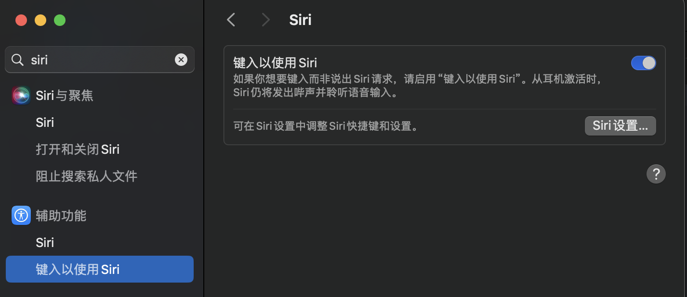
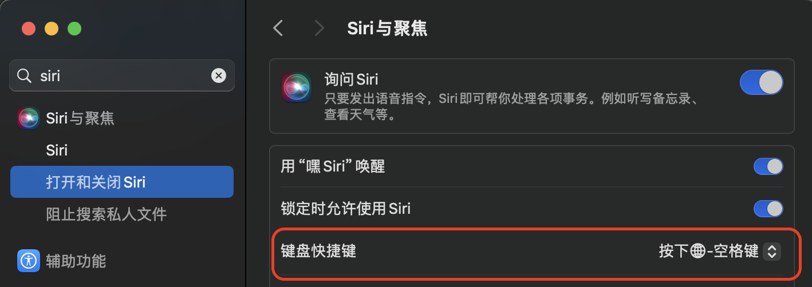
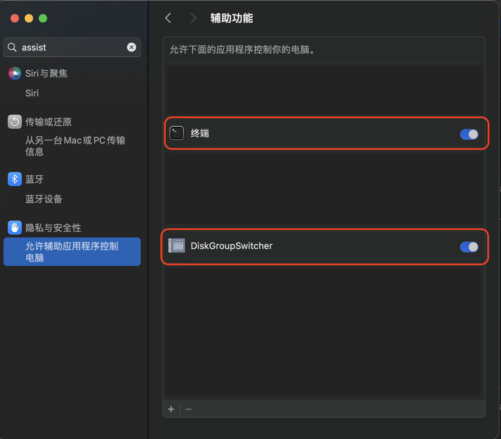

# Talk to Siri by keyboard

## 1. Enable "Type to Siri" in Settings



## 2. Config hot key for Siri



## 3. [Install Homebrew](https://brew.sh)

## 4. Install macism

```bash
brew tap laishulu/macism
brew install macism
```

## 5. Install cliclick

```bash
brew install cliclick
```

## 6. Allow applications to control your computer


